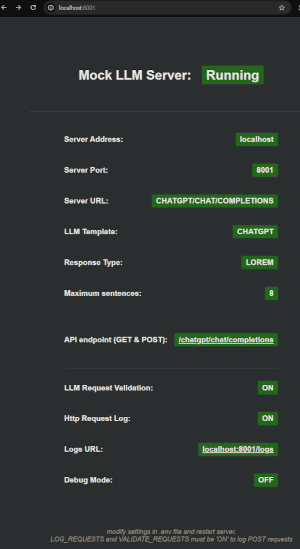

# Local Mock LLM API Framework

## Purpose

The purpose of this project is to provide a quick-to-set-up standalone local mock LLM API framework running on localhost for developing with Large Language Models such as Chat-GPT.

This can be used for testing API code and logic before deploying to live servers or quickly producing API endpoints for rapid prototyping for developing frontend clients for web or mobile.

The project is built using MSW and can be run directly on a local machine or in docker containers. It is further adapted from our own general mock-api framework here: https://github.com/piyook/mock-api-framework-template

## Set-up

Clone the repo & install dependencies.

## Starting

#### Docker

To start in docker run

```
npm start
```

Your apis will be available on localhost:8001/api by default but this can be customised - see later.

To stop and remove containers run

```
npm stop
```

To rebuild containers run :

```
npm run rebuild
```

To destroy everything and then rebuild the project (removing node modules, caches and all docker resources) run:

```
npm run nuke
```

#### Local Machine

To run directly on your local machine not using docker

```
npm run dev
```

## Using the Mock LLM Framework



### Available endpoints

Available endpoints are listed at the url root

```
http://localhost:8001
```

### Change api url prefix

By default the api paths with be prefixed with "api/" this can be modified with the LLM_URL_ENDPOINT environment variable in the .env file.

By setting this to blank then the path will just be the api name E.g localhost:8001/users

You can set this to any value E.g

```
LLM_URL_ENDPOINT=things
```

will give

```
localhost:8001/things/users
```

This can be used to match the expected path for the LLM (E.g for chatGPT it is 'chatgpt/chat/completions')

### Change port number

By default this is set to 8000 but can be changed by setting the SERVER_PORT in the .env file:

```
SERVER_PORT=1234
```

### Return stored responses

Set the following environment variable to 'stored' to use responses stored int the data/data.json file:

```
MOCK_LLM_RESPONSE_TYPE=stored
```

The responses increment for each http request and restart as the beginning once all have been used.

### Return randomly generated lorem ipsum responses

Set the following environment variable to 'lorem' to use responses stored in the data/data.json file:

```
MOCK_LLM_RESPONSE_TYPE=lorem
```

A random number of sentences are generated in the response and the maximum sentence number can be set with:

```
MAX_LOREM_PARAS=8
```

### Validate Requests to the LLM are in the correct format

-   add a request template for the LLM of choice
-   set env var to ON

### Debugging

You can toggle the detailed debug mode that shows more detail on each request in the terminal and response by setting:

```
DEBUG=*
```

set to FALSE to remove debugging details

### Validating Requests

Requests can be validated against the template in the request-templates folder.  
Set the VALIDATE_REQUESTS env var to true to enable this.
Requests that don't pass the validation will result in an error.

### Logging Requests to the LLM Mock

The last request made to the mock can be viewed from

```
localhost:8001/logs
```

This page provides information sent to the LLM Mock and is useful during development.

To use this set the LOG_REQUESTS AND VALIDATE_REQUESTS to TRUE in the .env file.

## Using the LLM Mock In Practice

You will need to redirect all your LLM traffic to the mock llm endpoint. For example if using chatgpt and langchain:

set the endpoint to the following:

```
LLM_URL_ENDPOINT=chatgpt/chat/completions
```

this provides an enpoint on :

```
http://localhost:8001/chatgpt/chat/completions

```

In your LLM client llm-response code you can change the chatGPT baseURL if a DEV_MODE flag is set to 'on'

```
import { ChatOpenAI, OpenAIEmbeddings } from '@langchain/openai';

const chatModel = new ChatOpenAI({
        openAIApiKey: process.env.OPENAI_API_KEY,
        modelName: 'gpt-3.5-turbo',
        configuration:
            process.env.DEV_MODE === 'true'
                ? {
                      baseURL: process.env.DEV_BASE_URL,
                  }
                : {},
    });

```

For example

```
DEV_MODE=true
DEV_BASE_URL=http://localhost:8001/chatgpt
```

note that you will also need to prevent requests for embeddings - you can do this in langchain using something like

```
import { FakeEmbeddings } from 'langchain/embeddings/fake';


let embeddings;

    if (process.env.DEV_MODE === 'true') {
        embeddings = new FakeEmbeddings();
        console.log(
            `WARNING: DEV MODE IS ON. Using fake embeddings and localhost mock server on ${process.env?.DEV_BASE_URL}`,
        );
    } else {
        embeddings = new OpenAIEmbeddings({
            openAIApiKey: process.env.OPENAI_API_KEY,
        });
    }

```

and then continue to use the code as for normal requests. Setting Dev mode to false will enable real requests to be made.

Its often useful when developing chatbots and assistants to get back a variety of responses. You can set the LLM Mock env vars to use either random lorem ipsum (up to a maximum number of sentences )

```
MOCK_LLM_RESPONSE_TYPE=lorem
MAX_LOREM_PARAS=8
```

or use stored responses that are randomly provided by setting

```
MOCK_LLM_RESPONSE_TYPE=stored

```
