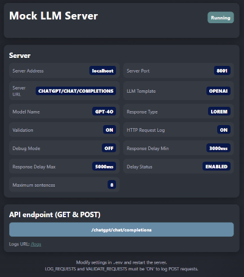
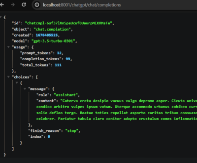
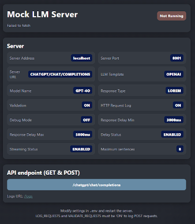

# Local Mock LLM API Framework

[](https://github.com/piyook/llm-mock/releases)
[](https://github.com/piyook/llm-mock/actions/workflows/tests.yaml)
[](https://opensource.org/licenses/MIT)

## Overview

A quick-to-setup standalone local mock LLM API framework for developing applications with Large Language Models like ChatGPT. This project provides a local server running on localhost that simulates LLM endpoints, enabling efficient frontend development and testing without the costs and complexity of production LLM services.

### Why Use LLM Mock?

- **Free and Fast**: No API costs, instant responses for rapid prototyping
- **Easier Setup**: Simpler than running a full local LLM for frontend development
- **Consistent Testing**: Predictable, repeatable responses for testing UI logic
- **Offline Capable**: Work without internet connectivity
- **Full Visibility**: Complete debugging and logging of all LLM requests
- **Request Validation**: Verify your requests match the expected API format
- **Realistic Delays**: Simulate production API response times to test loading states and timeout handling
- **Streamed or Static Responses**: Choose between streaming Server-Sent Events or static JSON responses to match your target LLM API behavior
- **OpenAI-Style API Compatibility**: Works with any OpenAI-compatible API including ChatGPT, Grok, Llama, DeepSeek, and more
- **Robust Local Server Framework**: Built with [Fastify](https://www.fastify.io/) for high performance and reliability

Adapted from the [mock-api-framework-template](https://github.com/piyook/mock-api-framework-template).

## Prerequisites

- Node.js 20+
- Docker (for containerized deployment)
- npm or compatible package manager

## Installation

Clone the repository and install dependencies:

```bash
git clone https://github.com/piyook/llm-mock.git
cd llm-mock
npm install
```

## Quick Start



### Using Docker (Recommended)

Start the server in Docker containers:

```bash
npm start
```

Your LLM API will be available at `http://localhost:8001` by default.

**Managing Docker Containers:**

```bash
# Stop and remove containers
npm stop

# Rebuild containers
npm run rebuild

# Complete cleanup (removes node_modules, caches, and all Docker resources)
npm run nuke
```

### Running Locally

Run directly on your machine without Docker:

```bash
npm run dev
```

This starts the mock server locally. For details on the Svelte-based dashboard and UI development workflow, see `UI-Dev.md`.

## Configuration

### Environment Variables

Configure the mock server by editing the `.env` file:

#### Server Settings

```bash
# Server port (default: 8001)
SERVER_PORT=8001

# API URL prefix (default: 'api')
# Set to blank for no prefix, or customize as needed
LLM_URL_ENDPOINT=api

# Debug mode - shows detailed request/response info in terminal
DEBUG=*  # Set to FALSE to disable
```

#### Response Configuration

```bash
# Response type: 'lorem' or 'stored'
MOCK_LLM_RESPONSE_TYPE=lorem

# Maximum sentences for lorem ipsum responses
MAX_LOREM_PARAS=8

# Streaming mode - enables OpenAI-style SSE streaming
STREAM=false

# Request validation
VALIDATE_REQUESTS=true
LOG_REQUESTS=true
```

#### Streaming Responses

Enable OpenAI-style Server-Sent Events (SSE) streaming for chat-completion responses:

```bash
# Enable streaming mode
STREAM=true

# Disable streaming (default - returns single JSON response)
STREAM=false
```

**How Streaming Works:**

- **`STREAM=true`**: Returns OpenAI-style SSE stream with `chat.completion.chunk` events
- **`STREAM=false`**: Returns standard single JSON response (existing behavior)
- The same endpoint URL is used in both modes - only the server-side response framing differs
- Streaming uses the same response template structure as static mode for consistency

**Streaming Response Format:**
```json
data: {"id":"chatcmpl-123","object":"chat.completion.chunk","created":1234567890,"model":"gpt-4o","choices":[{"index":0,"delta":{"role":"assistant"}}]}

data: {"id":"chatcmpl-124","object":"chat.completion.chunk","created":1234567890,"model":"gpt-4o","choices":[{"index":0,"delta":{"content":"Hello"}}]}

data: {"id":"chatcmpl-125","object":"chat.completion.chunk","created":1234567890,"model":"gpt-4o","choices":[{"index":0,"delta":{"content":" world"}}]}

data: {"id":"chatcmpl-126","object":"chat.completion.chunk","created":1234567890,"model":"gpt-4o","choices":[{"index":0,"delta":{},"finish_reason":"stop"}]}

data: [DONE]
```

**Initial Chunk Behavior:**
- The first few chunks (typically 3-4) are sent immediately without delay
- This mimics real LLM API behavior where initial tokens arrive faster
- Subsequent chunks follow the configured `RESPONSE_DELAY_*` timing
- This provides realistic streaming simulation and better user experience

#### Response Delay Simulation

Simulate realistic API response times to test how your application handles network latency, loading states, and timeouts:

```bash
# Minimum delay in milliseconds (default: 0)
RESPONSE_DELAY_MIN=500

# Maximum delay in milliseconds (default: 0)
RESPONSE_DELAY_MAX=2000
```

**How Response Delays Work:**

- The mock server randomly selects a delay between `RESPONSE_DELAY_MIN` and `RESPONSE_DELAY_MAX` for each request
- Delays are applied to both GET and POST endpoints in the completions API
- When both values are `0` or unset, responses are returned immediately (backward compatible with previous versions)
- Helps test loading indicators, timeout handling, and user experience with real-world latency

**Delay Configuration Examples:**

```bash
# No delay - instant responses (default)
RESPONSE_DELAY_MIN=0
RESPONSE_DELAY_MAX=0

# Fast responses (for rapid development)
RESPONSE_DELAY_MIN=100
RESPONSE_DELAY_MAX=300

# Realistic production-like latency
RESPONSE_DELAY_MIN=800
RESPONSE_DELAY_MAX=2500

# Test slow network conditions
RESPONSE_DELAY_MIN=3000
RESPONSE_DELAY_MAX=8000

# Fixed delay (same min/max)
RESPONSE_DELAY_MIN=1000
RESPONSE_DELAY_MAX=1000
```

### Custom API Paths

You can customize endpoints this to match your LLM provider's path structure:

```bash
# ChatGPT format: http://localhost:8001/chatgpt/chat/completions
LLM_URL_ENDPOINT=chatgpt/chat/completions

```



```bash
# Gemini format: http://localhost:8001/models/gemini-pro:generateContent
LLM_URL_ENDPOINT=models/gemini-pro:generateContent
```

## Features

### Available Endpoints

View all available endpoints by visiting:

```
http://localhost:8001
```

### Response Types

#### 1. Lorem Ipsum Responses

Generate random placeholder text for testing:

```bash
MOCK_LLM_RESPONSE_TYPE=lorem
MAX_LOREM_PARAS=8
```

Generates up to 8 random sentences per response. Perfect for testing UI rendering with variable content lengths.

https://github.com/user-attachments/assets/d36651ac-d7fa-41ad-b8d8-cd23812ae45a

#### 2. Stored Responses

Use predefined responses from `src/data/data.json`:

```bash
MOCK_LLM_RESPONSE_TYPE=stored
```

Add your custom responses to the JSON file:

```json
{
  "responses": [
    "This is a custom response for testing",
    "Another predefined response for consistency",
    "A third response to simulate variety"
  ]
}
```

The server randomly selects from stored responses, allowing you to test with realistic, domain-specific content.

https://github.com/user-attachments/assets/86115f16-63d7-49de-af32-c6f9c2bec7cf


### Request Validation

Validate incoming requests against templates to ensure API compatibility:

1. Add a request template in `request-templates/` folder
2. Enable validation in `.env`:

```bash
VALIDATE_REQUESTS=true
```

Invalid requests return detailed error messages explaining the format mismatch.

### Request Logging

Debug your LLM interactions by logging all requests:

1. Enable logging:

```bash
LOG_REQUESTS=true
VALIDATE_REQUESTS=true
```

2. View logged requests at:

```
http://localhost:8001/logs
```

Displays detailed information about each request including headers, body, and validation status.

## Integration Guide

### Using with LangChain and OpenAI-Style APIs

Configure your endpoint to match the OpenAI chat completion format:

```bash
LLM_URL_ENDPOINT=chatgpt/chat/completions
```

This creates the endpoint: `http://localhost:8001/chatgpt/chat/completions`

### Making API Requests

#### Static Mode (STREAM=false)

```bash
curl -N http://localhost:8001/chatgpt/chat/completions \
  -H "Content-Type: application/json" \
  -d '{ "model": "gpt-4o-mini", "messages": [{"role": "user","content": "Hello"}], "temperature": 1, "n": 1, "stream": false }'
```

Returns a single JSON response:
```json
{
  "id": "chatcmpl-6sf37lXn5paUcuf8UaurpMIKRMsTe",
  "object": "chat.completion", 
  "created": 1678485525,
  "model": "gpt-3.5-turbo-0301",
  "choices": [{"message": {"role": "assistant", "content": "Generated response"}}]
}
```

#### Streaming Mode (STREAM=true)

Set `STREAM=true` in your `.env` file, then use the same endpoint:

```bash
curl -N http://localhost:8001/chatgpt/chat/completions \
  -H "Content-Type: application/json" \
  -d '{ "model": "gpt-4o-mini", "messages": [{"role": "user","content": "Hello"}], "temperature": 1, "n": 1, "stream": false }'
```

Returns OpenAI-style SSE stream:
```
data: {"id":"chatcmpl-123","object":"chat.completion.chunk",...}

data: {"id":"chatcmpl-124","object":"chat.completion.chunk",...}

data: [DONE]
```

**Note:** The request payload is identical in both modes. The difference is in the server-side response framing, controlled by the `STREAM` environment variable.

#### Client Configuration

Update your LangChain configuration to use the mock server in development:

```javascript
import { ChatOpenAI, OpenAIEmbeddings } from '@langchain/openai';
import { FakeEmbeddings } from 'langchain/embeddings/fake';

// Configure model with conditional baseURL
const chatModel = new ChatOpenAI({
  openAIApiKey: process.env.OPENAI_API_KEY,
  modelName: 'gpt-3.5-turbo',
  configuration:
    process.env.DEV_MODE === 'true'
      ? {
          baseURL: process.env.DEV_BASE_URL, // http://localhost:8001/chatgpt
        }
      : {},
});

// Configure embeddings
let embeddings;

if (process.env.DEV_MODE === 'true') {
  embeddings = new FakeEmbeddings();
  console.log(
    `WARNING: DEV MODE IS ON. Using fake embeddings and localhost mock server on ${process.env?.DEV_BASE_URL}`
  );
} else {
  embeddings = new OpenAIEmbeddings({
    openAIApiKey: process.env.OPENAI_API_KEY,
  });
}
```

#### Environment Variables

```bash
# Development mode
DEV_MODE=true
DEV_BASE_URL=http://localhost:8001/chatgpt

# Production mode
DEV_MODE=false
```

Setting `DEV_MODE` to false will enable real requests to production LLM services.

## Supporting Different LLM Providers

Add support for any OpenAI-style API by creating request/response templates:

### OpenAI-Style API Compatibility

This mock server supports any LLM provider that uses the OpenAI chat completion API format, including:

- **ChatGPT** (OpenAI)
- **Grok** (xAI)
- **Llama** (Meta)
- **DeepSeek**
- **Mistral**
- **Claude** (Anthropic)
- **Gemini** (Google)
- And any other OpenAI-compatible API

The default configuration uses the OpenAI chat completion format, which works with most modern LLM providers. You can customize the request/response templates to match specific provider requirements.

### Creating Custom Templates

If you need to support a provider with different request/response formats, create custom templates:

### Step 1: Create Request Template

Create `request-templates/<LLM_NAME>_req.json` with the expected request format:

```json
{
  "model": "string",
  "messages": [
    {
      "role": "string",
      "content": "string"
    }
  ]
}
```

### Step 2: Create Response Template

Create `response-templates/<LLM_NAME>_res.json` with the response structure. Use `DYNAMIC_CONTENT_HERE` as a placeholder for generated content:

```json
{
  "id": "chatcmpl-123",
  "object": "chat.completion",
  "created": 1234567890,
  "model": "gpt-3.5-turbo",
  "choices": [
    {
      "index": 0,
      "message": {
        "role": "assistant",
        "content": "DYNAMIC_CONTENT_HERE"
      },
      "finish_reason": "stop"
    }
  ]
}
```

The `DYNAMIC_CONTENT_HERE` placeholder is where lorem ipsum or stored responses will be injected into the response object.

### Step 3: Configure Environment

Update `.env` with your LLM name and endpoint:

```bash
LLM_URL_ENDPOINT=models/gemini-pro:generateContent
LLM_NAME=gemini
VALIDATE_REQUESTS=true
```

### Example: Google Gemini

Example configuration files for Gemini are included in the repository. Set up with:

```bash
LLM_URL_ENDPOINT=models/gemini-pro:generateContent
LLM_NAME=gemini
VALIDATE_REQUESTS=true
```

Access at: `http://localhost:8001/models/gemini-pro:generateContent`

Any LLM framework that supports OpenAI-style APIs (such as LangChain) can be updated to use this endpoint following the same pattern as the example above.

## Debugging

Enable detailed logging to console to troubleshoot issues:

```bash
# Enable debug mode
DEBUG=*

# Disable debug mode
DEBUG=false
```

Debug mode displays:
- Incoming request details
- Request validation results
- Response generation process
- Timing information
- Applied response delays

## Development Workflow

### Recommended Development Flow

1. **Start with lorem responses and no delays** for rapid UI development:
   ```bash
   MOCK_LLM_RESPONSE_TYPE=lorem
   RESPONSE_DELAY_MIN=0
   RESPONSE_DELAY_MAX=0
   ```

2. **Add response delays** to test loading states and spinners:
   ```bash
   RESPONSE_DELAY_MIN=500
   RESPONSE_DELAY_MAX=1500
   ```

3. **Test with varied latency** to ensure robust error handling:
   ```bash
   RESPONSE_DELAY_MIN=100
   RESPONSE_DELAY_MAX=5000
   ```

4. **Switch to stored responses** for realistic content testing:
   ```bash
   MOCK_LLM_RESPONSE_TYPE=stored
   # Add domain-specific responses to src/data/data.json
   ```

5. **Enable streaming** to test real-time response handling:
   ```bash
   STREAM=true
   # Test your client's streaming response parsing
   ```

6. **Enable validation** before deploying to production:
   ```bash
   VALIDATE_REQUESTS=true
   LOG_REQUESTS=true
   ```

7. **Test with production LLM** by setting `DEV_MODE=false`

### Testing Different Scenarios

The mock server enables comprehensive testing:

- **Loading indicators**: Use response delays to test loading states
- **Timeout handling**: Set high delay values to test timeout logic
- **Error handling**: Modify response templates to return errors
- **Variable content**: Use lorem or multiple stored responses
- **Streaming responses**: Enable `STREAM=true` to test real-time response parsing
- **Offline development**: Work without internet connectivity
- **Cost-free prototyping**: Test UI/UX without API charges

## Project Structure

```
llm-mock/
├── src/
│   ├── data/
│   │   └── data.json              # Stored responses
│   ├── request-templates/          # OpenAI-style request format templates
│   │   ├── openai_req.json         # Default OpenAI chat completion format
│   │   └── gemini_req.json         # Gemini-specific format example
│   ├── response-templates/         # OpenAI-style response format templates
│   │   ├── openai_res.json         # Default OpenAI chat completion response
│   │   └── gemini_res.json         # Gemini-specific response example
│   └── ...
├── .env                            # Configuration
├── .env.chatgpt                    # ChatGPT/OpenAI preset
├── .env.gemini                     # Gemini preset
├── .env.streaming                  # Streaming mode preset
├── docker-compose.yml
└── package.json
```

## Troubleshooting

### Common Issues

**Server not responding:**

Check server is up and running on correct port set in `.env` E.g http://localhost:8001



**Port already in use:**
```bash
# Change port in .env
SERVER_PORT=8002
```

**Validation failures:**
- Check your request template matches your LLM's API format
- Review logs at `http://localhost:8001/logs`
- Ensure `LLM_NAME` matches template filenames

**Response delays not working:**
- Verify both `RESPONSE_DELAY_MIN` and `RESPONSE_DELAY_MAX` are set
- Check that values are greater than 0
- Restart the server after changing environment variables

**Docker issues:**
```bash
# Complete cleanup and rebuild
npm run nuke
npm install
npm start
```

## Contributing

Contributions are welcome! This project is built on the [mock-api-framework-template](https://github.com/piyook/mock-api-framework-template).

## License

MIT License - see [LICENSE](LICENSE) file for details.

## Related Projects

- [mock-api-framework-template](https://github.com/piyook/mock-api-framework-template) - General mock API framework
- [Fastify](https://www.fastify.io/) - Fast and low overhead web framework

---

**Topics:** mock-server, openai-api, llm, chat-completions, langchain, local-development-environment, streaming-api