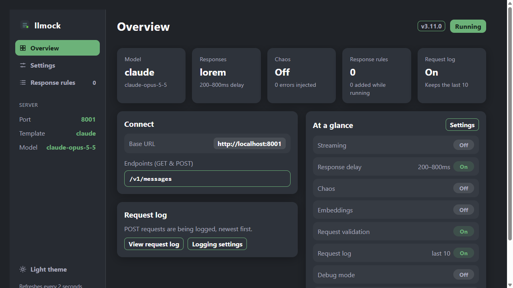
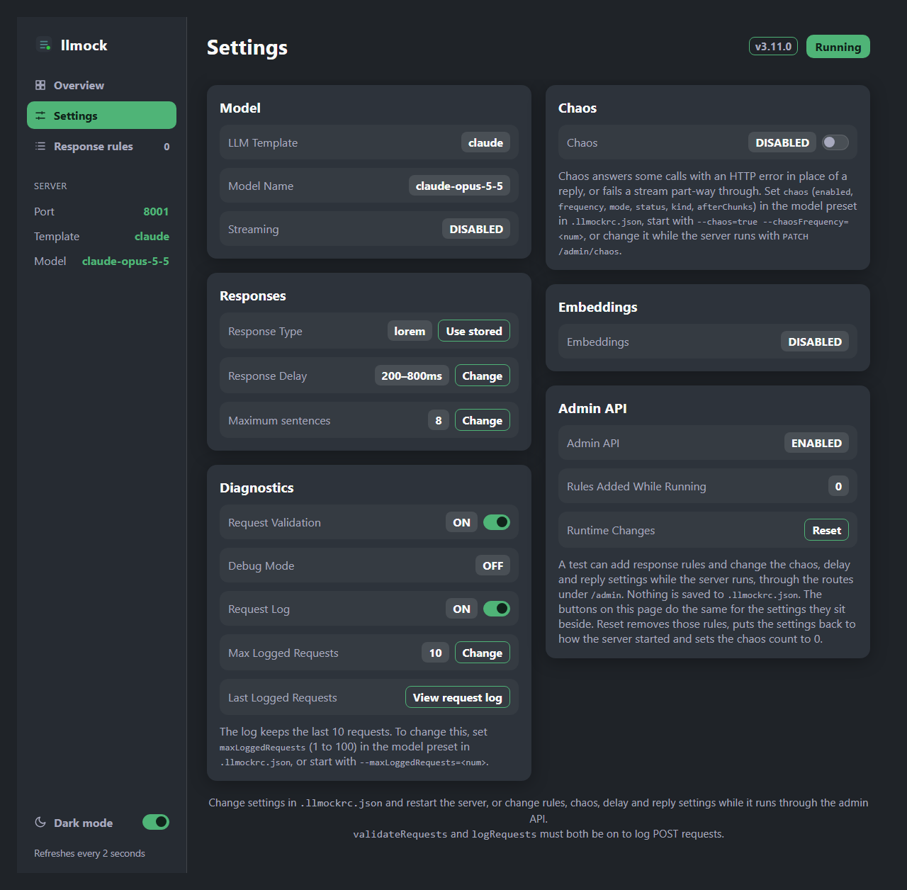
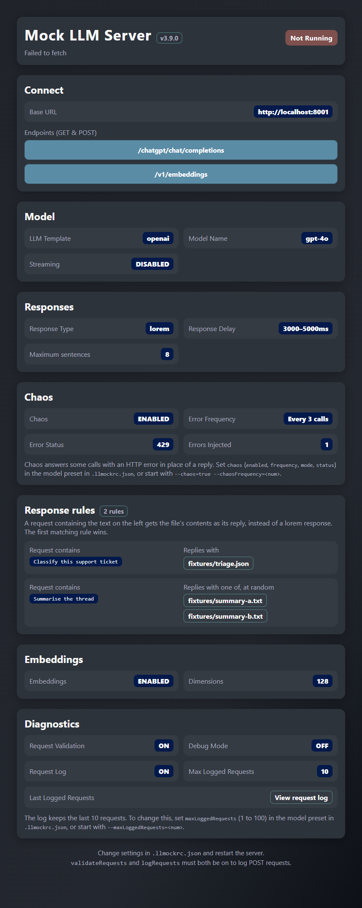

# LLMock — Local Mock LLM API

[](https://github.com/piyook/llm-mock/releases)
[](https://github.com/piyook/llm-mock/actions/workflows/tests.yaml)
[](https://opensource.org/licenses/MIT)
[](https://www.npmjs.com/package/llmock)

A lightweight local server that simulates LLM APIs for development and testing. Build and test AI-powered applications without API costs or an internet connection.

> **Using a coding agent?** Point it at [`llms.txt`](llms.txt) (shipped in the npm package at `node_modules/llmock/llms.txt`) — a compact reference to the CLI, config schema, response shapes and gotchas.

---

## Table of Contents

- [Why LLMock?](#why-llmock)
- [Quick Start](#quick-start)
- [Installation Options](#installation-options)
  - [CLI options](#cli-options)
- [Configuration](#configuration)
  - [Configuration file](#configuration-file-llmockrcjson)
  - [Adding custom models](#adding-custom-models)
  - [Response types](#response-types)
  - [Response rules (fixture replies)](#response-rules-fixture-replies)
    - [Truncated and refused replies](#truncated-and-refused-replies-stopreason)
    - [Failing one prompt](#failing-one-prompt-fail)
  - [Streaming responses](#streaming-responses)
  - [Response delay simulation](#response-delay-simulation)
  - [Chaos mode (error simulation)](#chaos-mode-error-simulation)
    - [Stream failures](#stream-failures)
  - [Admin API](#admin-api-changing-rules-and-settings-while-running)
  - [Custom API paths](#custom-api-paths)
- [Features](#features)
  - [Dashboard](#dashboard)
  - [Request validation](#request-validation)
  - [Request logging](#request-logging)
- [Integration Guide](#integration-guide)
  - [Chat completions](#chat-completions)
  - [Embeddings API](#embeddings-api)
  - [Using with LangChain](#using-with-langchain)
- [Supporting Different LLM Providers](#supporting-different-llm-providers)
  - [Anthropic (Claude Messages API)](#anthropic-claude-messages-api)
  - [Creating a custom provider template](#creating-a-custom-provider-template)
- [Docker Support](#docker-support)
  - [Standalone Docker setup](#standalone-docker-setup-no-scaffolding)
- [Troubleshooting](#troubleshooting)
- [License](#license)

---

## Why LLMock?

- **Free and fast** — no API costs, instant responses for rapid prototyping
- **Simple and lightweight** — easier to set up than a local model and uses far fewer system resources
- **Consistent testing** — predictable, repeatable responses for testing UI logic
- **Offline capable** — works without internet connectivity
- **Full visibility** — complete request logging and a live dashboard
- **Realistic simulation** — configurable delays, SSE streaming, and mock embeddings
- **Intermittent errors** — chaos mode fails every call or 1 in X calls with a 429, 500 or any other error status, to test retries and error handling
- **OpenAI-compatible** — works with ChatGPT, Grok, Llama, DeepSeek, Gemini, and any OpenAI-style API
- **Anthropic Messages API** — built-in `claude` preset with the SDK's streaming event format
- **Fixture replies** — return canned text or JSON for requests that contain a chosen string
- **Your own reply pools** — pick at random from a set of your own texts, per rule or as the default reply

Built on [Fastify](https://www.fastify.io/) for high performance and reliability.

---

## Quick Start

**Prerequisites:** Node.js 20 or later (24 LTS recommended; it is the version LLMock is tested on)

The fastest way to get started is with the scaffolding tool, which creates a complete project with configuration files and example templates:

```bash
npm create llmock@latest my-project
cd my-project
npm install
npm run llmock:start
```

Open `http://localhost:8001` to see the live dashboard.

That's it. To run against a specific model preset:

```bash
npm run llmock:chatgpt      # OpenAI ChatGPT-style (default)
npm run llmock:gemini       # Google Gemini format
npm run llmock:claude       # Anthropic Claude Messages API (/v1/messages)
npm run llmock:streaming    # OpenAI-style with SSE streaming
npm run llmock:embeddings   # Optimised for embeddings/RAG testing
```

### Scaffolded project layout

```
my-project/
├── package.json
├── .llmockrc.json
├── README.md
├── Dockerfile
├── docker-compose.yml
├── request-templates/
│   ├── openai_req.json
│   ├── gemini_req.json
│   └── claude_req.json
└── response-templates/
    ├── openai_res.json
    ├── gemini_res.json
    └── claude_res.json
```

The template folders contain editable copies of the built-in OpenAI, Gemini and Claude templates. The server uses them for request validation and response shape. To add your own provider, see [Template locations](#template-locations).

---

## Installation Options

### Option 1: Scaffolded project (recommended)

```bash
npm create llmock@latest my-project
```

Generates a ready-to-use project with configuration, templates, and Docker support.

### Option 2: Add to an existing project

```bash
npm install llmock
# or globally
npm install -g llmock
```

Then use the CLI directly:

```bash
llmock start                        # uses defaultModel from .llmockrc.json (chatgpt if none), port 8001
llmock start --model=gemini
llmock start --model=claude         # Anthropic Messages API
llmock start --port=3000 --stream=true
llmock stop                         # add --port=3000 if not on 8001
llmock config                       # show current settings (accepts --model)
llmock help
```

All CLI flags support both `--key=value` and `--key value` formats and override `.llmockrc.json` at runtime. `start` is the default command, so `llmock --model=claude` works too.

`llmock start` returns once the server is answering. If the server cannot start (for example a config error), or one is already running on that port, it exits with an error instead; run with `--foreground` to see the server's own output.

### CLI options

Each option overrides the matching setting of the selected preset for that run:

| Option | Overrides | Value |
|---|---|---|
| `--model` | `defaultModel` | Name of a preset in `.llmockrc.json` |
| `--port` / `--host` | `server.port` / `server.host` | Port number / address |
| `--admin` | `server.admin` | `true` or `false` |
| `--uiTheme` | `server.uiTheme` | `dark` or `light` |
| `--endpoint` | `endpoint` | Path without a leading slash |
| `--responseType` | `responseType` | `lorem` or `stored` |
| `--maxLoremParas` | `maxLoremParas` | Number |
| `--validateRequests` | `validateRequests` | `true` or `false` |
| `--logRequests` | `logRequests` | `true` or `false` |
| `--maxLoggedRequests` | `maxLoggedRequests` | `1` to `100` |
| `--debug` | `debug` | `true` or `false` |
| `--stream` | `stream` | `true` or `false` |
| `--delayMin` / `--delayMax` | `responseDelay.min` / `.max` | Milliseconds |
| `--chaos` | `chaos.enabled` | `true` or `false` |
| `--chaosFrequency` | `chaos.frequency` | Whole number, `1` or more |
| `--chaosMode` | `chaos.mode` | `every` or `random` |
| `--chaosStatus` | `chaos.status` | `400` to `599` |
| `--chaosKind` | `chaos.kind` | `http`, `stream-error`, `stream-drop` or `stream-stall` |
| `--chaosAfterChunks` | `chaos.afterChunks` | Whole number, `0` or more |
| `--embeddings` | `embeddings.enabled` | `true` or `false` |
| `--embeddingDimensions` | `embeddings.dimensions` | Number |
| `--foreground` | | No value; keeps the server attached (see below) |

`llmock help` prints the same list. `responseRules` and `storedResponsesFile` can only be set in the config file; to add a rule to a running server, use the [admin API](#admin-api-changing-rules-and-settings-while-running).

### Foreground Mode

For Docker containers or when you want the server to stay attached to your terminal:

```bash
llmock start --foreground
```

The `--foreground` flag keeps the server process attached and forwards all output to your console. This is essential for Docker containers and useful for debugging. Without this flag, the server runs as a detached background process.

On Windows the background server starts without opening a console window. Use `llmock stop` to shut it down, or `llmock start --foreground` to keep it visible in your terminal.

### Option 3: Docker

```bash
npm create llmock@latest my-project
cd my-project
npm run docker:start
```

See [Docker Support](#docker-support) for full details, including how to run LLMock in Docker from your own project without the scaffolding.

---

## Configuration

### Configuration file (`.llmockrc.json`)

All settings live in `.llmockrc.json` in your project root. CLI flags always override these values. `defaultModel` names the preset used when you don't pass `--model`.

The config file is read once at startup, so restart the server after changing it. Fixture files and the stored responses file are read on every request, so edits to those apply straight away.

```json
{
  "defaultModel": "chatgpt",
  "models": {
    "chatgpt": {
      "name": "openai",
      "model": "gpt-4o",
      "endpoint": "chatgpt/chat/completions",
      "responseType": "lorem",
      "maxLoremParas": 8,
      "validateRequests": true,
      "logRequests": true,
      "debug": false,
      "stream": false,
      "responseDelay": {
        "min": 3000,
        "max": 5000
      },
      "embeddings": {
        "enabled": true,
        "dimensions": 128
      },
      "chaos": {
        "enabled": false,
        "frequency": 1,
        "mode": "every",
        "status": 500,
        "kind": "http",
        "afterChunks": 2
      }
    }
  },
  "server": {
    "port": 8001,
    "host": "0.0.0.0"
  }
}
```

**Configuration reference:**

| Option | Description |
|---|---|
| `name` | **Required.** LLM provider name (used for template loading) |
| `model` | Model identifier (e.g. `gpt-4o`, `gemini-pro`) |
| `endpoint` | **Required.** API endpoint path (not `v1/embeddings` while embeddings are enabled) |
| `responseType` | `"lorem"` (random text) or `"stored"` (predefined responses) |
| `storedResponsesFile` | Optional JSON file of your own texts for `"stored"` (see [Response types](#response-types)) |
| `maxLoremParas` | Max sentences in lorem ipsum responses |
| `validateRequests` | Validate incoming requests against templates |
| `logRequests` | Save the most recent requests to the log file |
| `maxLoggedRequests` | How many requests the log keeps (default `10`, at most `100`) |
| `debug` | Enable verbose console logging |
| `stream` | Return SSE streaming responses (the `claude` preset decides per request instead) |
| `responseDelay.min/max` | Response delay range in milliseconds |
| `responseRules` | Optional list of `{ match, file }` or `{ match, files }` fixture replies, each with an optional `stopReason`, or `{ match, fail }` to fail the calls that match (see [Response rules](#response-rules-fixture-replies)) |
| `chaos.enabled` | Fail some calls (see [Chaos mode](#chaos-mode-error-simulation)) |
| `chaos.frequency` | Fail 1 in this many calls (default `1`, every call) |
| `chaos.mode` | `"every"` (each Xth call, the default) or `"random"` (a 1 in X chance per call) |
| `chaos.status` | HTTP status of the error, `400` to `599` (default `500`) |
| `chaos.kind` | What a failing call gets: `"http"` (an HTTP error, the default), `"stream-error"`, `"stream-drop"` or `"stream-stall"` (see [Stream failures](#stream-failures)) |
| `chaos.afterChunks` | How many content deltas a failing stream sends first, `0` or more (default `2`) |
| `embeddings.enabled` | Enable the `/v1/embeddings` endpoint |
| `embeddings.dimensions` | Embedding vector size |
| `server.port` / `server.host` | Port and address the server listens on (`8001`, `0.0.0.0`) |
| `server.admin` | `false` turns the [admin API](#admin-api-changing-rules-and-settings-while-running) off (default `true`) |
| `server.uiTheme` | Colours of the [dashboard](#dashboard): `"dark"` (the default) or `"light"` |

Only `name` and `endpoint` are required in a preset. Anything left out uses: `responseType` `lorem`, `maxLoremParas` 8, `maxLoggedRequests` 10, no delay, and validation, logging, debug, streaming, embeddings and chaos off.

### Adding custom models

Extend the `models` object with any additional preset, then start with `--model=<name>`:

```json
{
  "models": {
    "my-model": {
      "name": "openai",
      "model": "gpt-3.5-turbo",
      "endpoint": "api/v1/chat/completions",
      "responseType": "stored",
      "validateRequests": true,
      "logRequests": false,
      "debug": true,
      "stream": false,
      "responseDelay": { "min": 1000, "max": 2000 },
      "embeddings": { "enabled": false, "dimensions": 64 }
    }
  }
}
```

```bash
llmock start --model=my-model
```

### Response types

**Lorem ipsum** — generates random placeholder text, good for testing variable-length content in the UI:

```json
{ "responseType": "lorem", "maxLoremParas": 8 }
```

**Stored responses** — returns one text from a pool, picked at random on each request. Without further settings the pool is a small set of fixed sentences bundled with the package:

```json
{ "responseType": "stored" }
```

To use your own pool, point `storedResponsesFile` at a JSON file:

```json
{ "responseType": "stored", "storedResponsesFile": "fixtures/replies.json" }
```

The file is a JSON array of strings:

```json
["First canned reply.", "Second canned reply.", "Third canned reply."]
```

- Entries can also be objects with a string `content`, the shape of the bundled data: `[{ "id": 1, "content": "First canned reply." }]`. Other keys are ignored.
- The path is resolved relative to the folder holding the config file.
- A path that is empty or not a string stops the server at startup. When the response type is `stored`, so does a file that is missing, unreadable, not valid JSON, not an array, an empty array, or that has an entry of any other shape.
- The file is checked at startup and then read again on every request, so you can edit it without restarting. If it becomes invalid while the server is running, requests return an error rather than falling back to the bundled sentences.
- A matching [response rule](#response-rules-fixture-replies) still wins. Use rules for a specific reply to a specific request, and stored responses for random variety on everything else.
- Works with every preset and with both static and streamed replies.

### Response rules (fixture replies)

Lorem text is fine for UI work, but some callers expect a specific shape, such as JSON that gets parsed. Add `responseRules` to a preset to return the contents of a file whenever the request contains a given string:

```json
{
  "models": {
    "chatgpt": {
      "responseRules": [
        { "match": "Classify this support ticket", "file": "fixtures/triage.json" },
        { "match": "Summarise the thread", "file": "fixtures/summary.txt" }
      ]
    }
  }
}
```

With a request whose message contains `Classify this support ticket`, the server replies with `fixtures/triage.json` as the message text, so the client can `JSON.parse` it. Anything that matches no rule gets the normal response for the preset's `responseType`.

- `match` is a case-sensitive substring, tested against every string value in the request body (message text, system prompt, content blocks), not against JSON keys.
- Rules are checked in order and the first match wins. `match` and `file` must be non-empty strings.
- GET requests have no body, so rules never apply to them.
- Matching covers the whole request, including earlier turns of a conversation. A rule that matched an early message keeps matching on every later turn, so use distinctive markers and put more specific rules first.
- `file` is resolved relative to the folder holding the config file, and is read exactly as written (including any trailing newline). It is read on every request, so you can edit it without restarting.
- For varied replies to the same kind of request, give a rule `files` instead of `file`: `{ "match": "Summarise the thread", "files": ["fixtures/summary-a.txt", "fixtures/summary-b.txt"] }`. One of the files is picked at random on each matching request. A rule has either `file` or `files`, not both, and `files` must be a non-empty list of non-empty strings.
- For a short reply, a rule can hold the reply itself as `text` in place of a file: `{ "match": "Classify this support ticket", "text": "{\"priority\":\"high\"}" }`. A rule has only one of `text`, `file` and `files`.
- To add a rule while the server is running, use the [admin API](#admin-api-changing-rules-and-settings-while-running).
- A malformed rule stops the server at startup. An unreadable fixture (including any entry of `files`) logs a warning at startup, and a request that needs it returns an error rather than falling back to generated text.
- Works with every preset and with both static and streamed replies.

#### Truncated and refused replies (`stopReason`)

A real model does not always finish its answer: it can run out of tokens, or decline. To test how your app handles that, give a rule a `stopReason`:

```json
{
  "responseRules": [
    { "match": "Summarise this", "file": "fixtures/cut-off.txt", "stopReason": "max_tokens" },
    { "match": "Write the exploit", "file": "fixtures/refused.txt", "stopReason": "refusal" }
  ]
}
```

| `stopReason` | `claude` | `openai` (and custom templates) | `gemini` |
|---|---|---|---|
| `end` (the default) | `stop_reason: "end_turn"` | `finish_reason: "stop"` | `finishReason: "STOP"` |
| `max_tokens` | `stop_reason: "max_tokens"` | `finish_reason: "length"` | `finishReason: "MAX_TOKENS"` |
| `refusal` | `stop_reason: "refusal"` | `finish_reason: "content_filter"` | `finishReason: "SAFETY"` |

- The reply text is still the fixture, exactly as written. LLMock does not shorten it, so write a fixture that stops part-way through a sentence (or part-way through a JSON object, to test your parser).
- It works with `file` and `files`, and with static and streamed replies. In a `claude` stream the value is in the `message_delta` event; in an OpenAI-style stream it is the last chunk's `finish_reason`. A streamed `gemini` reply is OpenAI-style, so it carries the `openai` value.
- A refused `claude` reply also carries the `stop_details` object the Anthropic API sends with a refusal: `{ "type": "refusal", "category": null, "explanation": null }`.
- A rule without `stopReason` behaves exactly as before. Any other value stops the server at startup.

#### Failing one prompt (`fail`)

[Chaos mode](#chaos-mode-error-simulation) fails 1 in X calls, whichever they are. To fail one particular prompt and leave the rest alone, give a rule `fail`:

```json
{
  "responseRules": [
    { "match": "Summarise the Q3 report", "fail": { "kind": "stream-error", "status": 529, "afterChunks": 1 } },
    { "match": "Translate this", "fail": { "status": 429 } }
  ]
}
```

| `fail` setting | What it does | Default |
|---|---|---|
| `kind` | `"http"`, `"stream-error"`, `"stream-drop"` or `"stream-stall"`, as in [Stream failures](#stream-failures) | `"http"` |
| `status` | HTTP status of the error, `400` to `599` | `500` |
| `afterChunks` | How many content deltas a failing stream sends first | `2` |

- Every call that matches the rule fails, whether or not chaos is on. Every other call is untouched, so your tests do not depend on the order the calls arrive in.
- The call gets exactly what a failing chaos call of that `kind` gets: the same error bodies, the `x-llmock-chaos: true` header, and the same handling of a call that did not ask for a stream.
- All three settings are optional: `"fail": {}` is an HTTP 500. They are the rule's own; nothing is taken from the preset's `chaos`.
- A rule with `fail` needs no `file` or `files`. Add one to choose the text a `stream-*` failure sends before it fails; without one that text is a normal generated reply.
- The rule fails every time, so a client that retries the same prompt fails again. To have a retry succeed, use chaos with `frequency: 2`.
- These failures are added to the dashboard's chaos count, but do not shift which of the other calls chaos fails.
- A `fail` that is not valid stops the server at startup.

### Streaming responses

Enable OpenAI-style Server-Sent Events (SSE) streaming in your config or via CLI:

```json
{ "stream": true }
```

```bash
llmock start --stream=true
```

For the `claude` preset streaming is chosen per request instead: it streams when the request body has `"stream": true`, whatever this setting says (see [Anthropic](#anthropic-claude-messages-api)).

When enabled, the endpoint returns a chunked SSE stream. The server waits for the configured response delay, then sends the chunks at least 50 ms apart.

```
data: {"id":"chatcmpl-123","object":"chat.completion.chunk","choices":[{"delta":{"role":"assistant"}}]}

data: {"id":"chatcmpl-124","object":"chat.completion.chunk","choices":[{"delta":{"content":"Hello"}}]}

data: [DONE]
```

### Response delay simulation

Simulate realistic API latency to test loading states, timeout handling, and UX:

```json
{
  "responseDelay": { "min": 800, "max": 2500 }
}
```

Set both values to `0` for instant responses. The server picks a random value in the range for each request.

| Profile | min | max |
|---|---|---|
| Instant (development) | 0 | 0 |
| Fast | 100 | 300 |
| Realistic production | 800 | 2500 |
| Slow / timeout testing | 3000 | 8000 |
| Fixed delay | 1000 | 1000 |

### Chaos mode (error simulation)

Turn on chaos to have some calls fail, so you can test retries, backoff and error handling. By default a failing call is answered with an HTTP error in place of a reply:

```json
{
  "chaos": { "enabled": true, "frequency": 3, "mode": "every", "status": 429 }
}
```

```bash
llmock start --chaos=true --chaosFrequency=3 --chaosStatus=429
```

| Setting | CLI flag | Meaning | Default |
|---|---|---|---|
| `enabled` | `--chaos` | Chaos on or off | `false` |
| `frequency` | `--chaosFrequency` | Fail 1 in this many calls. `1` fails every call | `1` |
| `mode` | `--chaosMode` | `"every"` fails calls X, 2X, 3X and so on, which is repeatable. `"random"` gives each call a 1 in X chance of failing | `"every"` |
| `status` | `--chaosStatus` | HTTP status of the error, `400` to `599` | `500` |
| `kind` | `--chaosKind` | What a failing call gets: `"http"`, `"stream-error"`, `"stream-drop"` or `"stream-stall"` (see [Stream failures](#stream-failures)) | `"http"` |
| `afterChunks` | `--chaosAfterChunks` | How many content deltas a failing stream sends before it fails | `2` |

- Chaos applies to the chat endpoint and `/v1/embeddings`, which share one call count. The dashboard, `/ping` and the `/ui-*` routes never fail.
- Only a call that would have succeeded is counted. An invalid request still gets its `400`.
- The response delay runs first, then the error is sent. A streamed call that fails gets the same JSON error, with no stream (unless `kind` says otherwise, see [Stream failures](#stream-failures)).
- The error body has the shape the preset's provider uses, so your client's own error parsing runs:

  | Preset `name` | Error body |
  |---|---|
  | `openai` (and custom templates) | `{ "error": { "message", "type", "param", "code" } }` |
  | `claude` | `{ "type": "error", "error": { "type", "message" } }` with `rate_limit_error` (429), `overloaded_error` (529) or `api_error` |
  | `gemini` | `{ "error": { "code", "message", "status" } }` with `RESOURCE_EXHAUSTED` (429), `UNAVAILABLE` (503) or `INTERNAL` |

  `/v1/embeddings` always uses the `openai` shape.
- A `429`, `503` or `529` carries `retry-after: 1`. Every chaos error carries `x-llmock-chaos: true`, so a test can tell it from a real failure.
- A `frequency`, `mode`, `status`, `kind` or `afterChunks` in the config file that is not valid stops the server at startup.
- The **Chaos** box on the dashboard's **Settings** page shows the settings and how many calls have been failed since the server started.

#### Stream failures

An HTTP error is the easy failure to handle. The one that catches streaming apps out is a reply that starts and then dies. Set `kind` to have a failing call do that:

```json
{
  "chaos": { "enabled": true, "frequency": 2, "kind": "stream-error", "afterChunks": 2 }
}
```

```bash
llmock start --model=claude --chaos=true --chaosFrequency=2 --chaosKind=stream-error
```

| `kind` | What a failing streamed call gets |
|---|---|
| `http` | The HTTP error described above, with no stream. This is the default |
| `stream-error` | The stream starts, sends `afterChunks` content deltas, then sends the provider's in-stream error and ends |
| `stream-drop` | The stream starts, sends `afterChunks` content deltas, then the connection is cut with nothing more sent |
| `stream-stall` | The stream starts, sends `afterChunks` content deltas, then goes silent. The connection stays open until your client gives up |

With the settings above, every 2nd streamed call to the `claude` preset looks like this:

```
event: message_start
data: {"type":"message_start","message":{...}}

event: content_block_start
data: {"type":"content_block_start","index":0,"content_block":{"type":"text","text":""}}

event: content_block_delta
data: {"type":"content_block_delta","index":0,"delta":{"type":"text_delta","text":"Lorem ipsum "}}

event: content_block_delta
data: {"type":"content_block_delta","index":0,"delta":{"type":"text_delta","text":"dolor sit "}}

event: error
data: {"type":"error","error":{"type":"api_error","message":"llmock chaos: simulated 500 error"}}
```

- `frequency` and `mode` still decide which calls fail, and the dashboard's count includes these failures.
- The stream has status `200`, because its headers have gone before it fails, and carries `x-llmock-chaos: true`. None of the closing events are sent: no `message_stop` for `claude`, no `data: [DONE]` for an OpenAI-style stream.
- `afterChunks` counts content deltas. `0` fails straight after the opening events. If the reply has fewer deltas than `afterChunks`, the stream fails after the last one. A reply is split into about 5 deltas.
- For `claude` the in-stream error is an `event: error` whose error `type` follows `status` (`rate_limit_error` for 429, `overloaded_error` for 529, otherwise `api_error`). An OpenAI-style stream (`openai`, `gemini` and custom templates) gets a `data:` line holding the `openai` error body.
- A failing call that did not ask for a stream has no stream to cut. With `stream-error` it gets the HTTP error. With `stream-drop` the connection is cut without an answer, and with `stream-stall` it is held open without one. This includes `/v1/embeddings`.
- `stream-stall` never times out on the server, so give the client you are testing a timeout. Stalled connections are dropped when the server stops.

With the Anthropic SDK, a `stream-error` call makes the stream throw:

```js
const stream = client.messages.stream({
  model: 'claude-opus-5-5',
  max_tokens: 256,
  messages: [{ role: 'user', content: 'Hello' }],
});

try {
  await stream.finalMessage();
} catch (error) {
  // The text received before the failure is incomplete: discard it and retry
}
```

### Admin API (changing rules and settings while running)

The config file is read once, when the server starts. The admin API lets a test (or a coding agent) add a response rule to a running server, or change its chaos and delay settings, with no file to write and no restart:

```js
// Before the test: reply to this prompt with this text
await fetch('http://localhost:8001/admin/rules', {
  method: 'POST',
  headers: { 'content-type': 'application/json' },
  body: JSON.stringify({ match: 'Classify this ticket', text: '{"priority":"high"}' }),
});

// After the test: back to how the server started
await fetch('http://localhost:8001/admin/reset', { method: 'POST' });
```

| Route | What it does |
|---|---|
| `GET /admin/rules` | Lists every rule in the order requests are matched against them |
| `POST /admin/rules` | Adds a rule: `{ "match", "text", "stopReason"?, "fail"?, "times"? }`. Answers `201` with the rule and its `id` |
| `DELETE /admin/rules/<id>` | Removes one rule added this way |
| `DELETE /admin/rules` | Removes every rule added this way |
| `GET /admin/chaos` | Shows the [chaos](#chaos-mode-error-simulation) settings in use, and how many calls were counted and failed |
| `PATCH /admin/chaos` | Changes the chaos settings it is given: `enabled`, `frequency`, `mode`, `status`, `kind`, `afterChunks` |
| `GET /admin/delay` | Shows the [response delay](#response-delay-simulation) in use |
| `PATCH /admin/delay` | Changes the response delay: `{ "min", "max" }` in milliseconds |
| `GET /admin/settings` | Shows the reply settings in use |
| `PATCH /admin/settings` | Changes the reply settings it is given: `responseType`, `maxLoremParas`, `stream`, `validateRequests`, `logRequests`, `maxLoggedRequests` |
| `POST /admin/reset` | Goes back to how the server started: no rules added this way, the config file's chaos, delay and reply settings, and the chaos call count at 0 |

- A rule added this way works like a [response rule](#response-rules-fixture-replies) in the config file: the same `match`, the same optional [`stopReason`](#truncated-and-refused-replies-stopreason) and [`fail`](#failing-one-prompt-fail). It needs `text` or `fail`.
- The reply is given as `text`, never as `file` or `files`. The server has no login, so a path sent over HTTP would let anyone who can reach it read files from your machine.
- Rules added this way are matched before the config file's rules, in the order they were added. To replace a config rule for one test, add a rule with the same `match`.
- Give a rule `times` (a whole number, 1 or more) to have it answer that many matching requests and then remove itself. A call that [chaos](#chaos-mode-error-simulation) fails does not count, so the rule is still there for the retry. Without `times` a rule stays until you remove it or reset. `times` is for rules added this way only, not for the config file.
- Nothing is saved. The config file is never written, and a restart starts again with the config file's rules only.
- A rule that is not valid gets a `400` with `{ "error": "..." }` and is not added.
- Each rule in a listing has `source` (`"runtime"` or `"config"`), `id` (`null` for a config rule, which can not be removed this way) and `times` (how many more requests it answers, or `null` if it stays).
- Everything else (the port, the endpoint, the preset with its template and model name, embeddings, debug mode) still comes from the config file and needs a restart to change.

With `times`, a test can have the first call fail and the retry succeed, or give each call in turn its own reply:

```js
const addRule = (rule) =>
  fetch('http://localhost:8001/admin/rules', {
    method: 'POST',
    headers: { 'content-type': 'application/json' },
    body: JSON.stringify(rule),
  });

// The first call with this prompt gets a 529; the next one gets a normal reply
await addRule({ match: 'Summarise the report', fail: { status: 529 }, times: 1 });

// The first call gets "draft", the second "final", later ones a normal reply
await addRule({ match: 'Write the email', text: 'draft', times: 1 });
await addRule({ match: 'Write the email', text: 'final', times: 1 });
```

To switch what the server replies with for one test:

```js
await fetch('http://localhost:8001/admin/settings', {
  method: 'PATCH',
  headers: { 'content-type': 'application/json' },
  body: JSON.stringify({ responseType: 'stored', stream: true }),
});
```

To make calls fail part-way through a test, switch chaos on and reset afterwards:

```js
await fetch('http://localhost:8001/admin/chaos', {
  method: 'PATCH',
  headers: { 'content-type': 'application/json' },
  body: JSON.stringify({ enabled: true, frequency: 2, status: 429 }),
});
// The 2nd, 4th, 6th... call now fails with a 429
```

- `PATCH` changes only the settings you send; the others stay as they are. The settings mean what they mean in the config file's [`chaos`](#chaos-mode-error-simulation) and [`responseDelay`](#response-delay-simulation).
- A value that is not valid gets a `400` and nothing is changed. Nothing falls back to a default, unlike a CLI flag.
- Changing chaos settings leaves the call count alone. With `mode: "every"`, call `POST /admin/reset` first and then `PATCH /admin/chaos`, so the count starts from 0 and you know which call fails.
- `min` can not be more than `max`, and neither can be more than 2147483647 (about 24 days). Send both when you raise the delay from `0`.
- `PATCH /admin/settings` takes the same names and values as the model preset: `responseType` is `"lorem"` or `"stored"`, `stream`, `validateRequests` and `logRequests` are `true` or `false`, `maxLoremParas` is 1 to 1000 and `maxLoggedRequests` is 1 to 100.
- `"responseType": "stored"` uses the preset's [`storedResponsesFile`](#response-types) if it has one, otherwise the texts that come with LLMock. If that file can not be read, the change is refused with a `400`.
- `stream` has no effect on the `claude` template, where each request says whether it wants a stream.
- The dashboard shows the settings in use, so a change appears there within 2 seconds. The **Admin API** box on its **Settings** page has a **Reset** button that does the same as `POST /admin/reset`.
- To turn the admin API off, set `"admin": false` in the `server` block, or start with `--admin=false`. While it is on, a preset's `endpoint` can not start with `admin/`.

### Custom API paths

Set the endpoint to match any provider's path structure:

| `endpoint` | URL |
|---|---|
| `chatgpt/chat/completions` | `http://localhost:8001/chatgpt/chat/completions` |
| `models/gemini-pro:generateContent` | `http://localhost:8001/models/gemini-pro:generateContent` |

Write the path without a leading slash.

### Environment variables

LLMock does not read any of these itself. They are a suggested convention for your own app, so it can switch between the mock and the real provider (the [LangChain example](#using-with-langchain) uses them):

```bash
TEST_MODE=true
TEST_BASE_URL=http://localhost:8001/chatgpt
TEST_EMBEDDING_URL=http://localhost:8001/v1/embeddings
```

With `TEST_MODE=false` your app talks to the real LLM service again.

---

## Features

### Dashboard

Once running, open `http://localhost:8001` for the live dashboard:



| URL | Purpose |
|---|---|
| `http://localhost:8001` | Main dashboard |
| `http://localhost:8001/ping` | Health check |

The dashboard has three pages, listed in the sidebar on the left (across the top on a narrow window):

| Page | Address | Shows |
| --- | --- | --- |
| **Overview** | `http://localhost:8001/` | Server status and the llmock version, the base URL and endpoints to connect to, the main settings at a glance, and the request log |
| **Settings** | `http://localhost:8001/#/settings` | The configuration in use, grouped into **Model**, **Responses**, **Diagnostics**, **Chaos**, **Embeddings** and **Admin API** |
| **Response rules** | `http://localhost:8001/#/rules` | Every response rule, in the order they are matched |

The figures across the top of the overview lead to the page that holds them. The dashboard refreshes automatically every 2 seconds.



The dashboard is dark by default. For a light one, set the `UI_THEME` environment variable, or `"uiTheme": "light"` in the `server` block of `.llmockrc.json`, or start with `--uiTheme=light`:

```bash
UI_THEME=light npx llmock start       # macOS, Linux, Git Bash
$env:UI_THEME = 'light'; npx llmock start   # PowerShell
```

The flag wins over the environment variable, which wins over the config file. In Docker, add `UI_THEME=light` to `environment` in `docker-compose.yml`. Any value other than `light` gives the dark theme.

With `responseType: "stored"` the **Settings** page names the stored responses file in use (or `Bundled`); click it to read every response in the pool. The **Response rules** page lists each of the preset's `responseRules` as its `match` text beside the file(s) it replies with, how the reply ends when the rule sets a `stopReason` other than `end`, and how the call fails when the rule sets `fail`; click a file to read its contents. A rule that holds its reply as `text` shows **its own text** in place of a file; click it to read the text. A rule added through the [admin API](#admin-api-changing-rules-and-settings-while-running) is listed first and marked **runtime**; one with `times` also shows how many requests it has left. With no rules set, the page shows a blank rule with a note pointing to the setting.

While the admin API is on, the values on the **Settings** page have a button beside them that changes the running server. The ones with two values switch at a click: **Response Type** (lorem or stored), **Streaming**, **Chaos**, **Request Validation** and **Request Log**. The others have **Change**, which opens boxes to fill in, with **Save** and **Cancel**: **Response Delay**, **Maximum sentences**, **Max Logged Requests** and, while chaos is on, **Error Frequency**, **Error Status**, **Failure Kind** and **Streams Fail**. A value the server refuses is explained in that box of the dashboard and the boxes stay open. A change made this way is not saved; **Reset** or a restart puts it back. (Streaming has no button on the `claude` template, where each request says whether it wants a stream.)

The **Admin API** box says whether the admin API is on and how many rules were added while running. **Reset** does what `POST /admin/reset` does, after asking you to confirm: it removes those rules, puts chaos and delay back to how the server started and sets the chaos count to 0.

### Available endpoints

| Endpoint | Description |
|---|---|
| Configurable (default: `/chatgpt/chat/completions`) | Chat completions |
| `/v1/messages` (with the `claude` preset) | Anthropic Messages API |
| `/v1/embeddings` | OpenAI-compatible mock embeddings |

### Request validation

Validate incoming requests against templates to confirm API compatibility:

1. Enable validation: `"validateRequests": true`
2. For a provider that is not built in, add a template to the `request-templates/` folder (see [Template locations](#template-locations))

A request passes when it contains every top-level key of the template. The built-in templates require `model` and `messages` (OpenAI), `contents` (Gemini), and `model`, `max_tokens` and `messages` (Claude). Invalid requests return a `400`; the missing keys are shown under **View request log** on the dashboard.

### Request logging

Enable with `"logRequests": true` and view the most recent requests, newest first, with **View request log** on the dashboard (as JSON at `http://localhost:8001/ui-request-log`). The viewer shows one request at a time with **Back** and **Next**, and **Clear logs** empties the log after asking you to confirm. The log keeps the last 10 requests; set `"maxLoggedRequests"` (or `--maxLoggedRequests=<num>`) to keep between 1 and 100. The log file holds those requests only, at:

| Platform | Log location |
|---|---|
| Windows | `C:\Users\{name}\AppData\Local\llm-mock-nodejs\Log\` |
| macOS | `~/Library/Logs/llm-mock-nodejs/` |
| Linux | `~/.local/state/llm-mock-nodejs/` |

### Debug mode

Enable verbose console output to see incoming request details, validation results, response generation steps, and timing:

```bash
llmock start --debug=true
```

---

## Integration Guide

### Chat completions

#### Standard (non-streaming)

```bash
curl http://localhost:8001/chatgpt/chat/completions \
  -H "Content-Type: application/json" \
  -d '{
    "model": "gpt-4o-mini",
    "messages": [{"role": "user", "content": "Hello"}],
    "temperature": 1,
    "stream": false
  }'
```

```json
{
  "id": "chatcmpl-6sf37lXn5paUcuf8UaurpMIKRMsTe",
  "object": "chat.completion",
  "created": 1678485525,
  "model": "gpt-3.5-turbo-0301",
  "choices": [{"message": {"role": "assistant", "content": "Generated response"}}]
}
```

#### Streaming

Enable `stream: true` in your config, then use the same endpoint:

```bash
curl -N http://localhost:8001/chatgpt/chat/completions \
  -H "Content-Type: application/json" \
  -d '{
    "model": "gpt-4o-mini",
    "messages": [{"role": "user", "content": "Hello"}],
    "stream": true
  }'
```

### Embeddings API

The mock server provides an OpenAI-compatible embeddings endpoint at `/v1/embeddings`:

```bash
curl http://localhost:8001/v1/embeddings \
  -H "Content-Type: application/json" \
  -d '{
    "model": "text-embedding-3-small",
    "input": "Your text string goes here"
  }'
```

Pass an array of strings for multiple embeddings in one call:

```bash
-d '{"model": "text-embedding-ada-002", "input": ["First text", "Second text"]}'
```

**Response format:**

```json
{
  "object": "list",
  "data": [
    {
      "object": "embedding",
      "index": 0,
      "embedding": [0.1234, -0.5678, 0.9012]
    }
  ],
  "model": "text-embedding-3-small",
  "usage": { "prompt_tokens": 6, "total_tokens": 6 }
}
```

Key characteristics of mock embeddings: deterministic (same input always returns the same vector), configurable dimensions, model-name-sensitive, and OpenAI-compatible in shape. Note that vectors are pseudo-random — they have the correct shape for testing but are not real semantic embeddings.

### Using with LangChain

Point your `ChatOpenAI` client at the mock server when `TEST_MODE` is enabled:

```javascript
import { ChatOpenAI } from '@langchain/openai';

const chatModel = new ChatOpenAI({
  openAIApiKey: process.env.OPENAI_API_KEY,
  modelName: 'gpt-3.5-turbo',
  configuration:
    process.env.TEST_MODE === 'true'
      ? { baseURL: process.env.TEST_BASE_URL } // http://localhost:8001/chatgpt
      : {},
});
```

For embeddings, use LangChain's built-in fake embeddings or call the mock endpoint directly:

```javascript
class MockEmbeddingsAPI {
  async embedDocuments(texts) {
    return Promise.all(texts.map(text => this.embedQuery(text)));
  }

  async embedQuery(text) {
    const response = await fetch(process.env.TEST_EMBEDDING_URL, {
      method: 'POST',
      headers: { 'Content-Type': 'application/json' },
      body: JSON.stringify({ input: text, model: 'text-embedding-ada-002' }),
    });
    const data = await response.json();
    return data.data[0].embedding;
  }
}

const embeddings =
  process.env.TEST_MODE === 'true'
    ? new MockEmbeddingsAPI()
    : new OpenAIEmbeddings({ openAIApiKey: process.env.OPENAI_API_KEY });
```

---

## Supporting Different LLM Providers

LLMock supports any provider that uses the OpenAI chat completion format: ChatGPT, Grok, Llama, DeepSeek, Mistral, Gemini, and more. Anthropic's Messages API has its own built-in preset (below). For other providers with different request/response shapes, create custom templates.

### Anthropic (Claude Messages API)

The `claude` preset serves `POST /v1/messages`. It is included in scaffolded projects and in the built-in defaults. If your `.llmockrc.json` predates it, add:

```json
{
  "models": {
    "claude": {
      "name": "claude",
      "model": "claude-opus-5-5",
      "endpoint": "v1/messages",
      "responseType": "lorem",
      "maxLoremParas": 8,
      "validateRequests": true,
      "stream": false,
      "responseDelay": { "min": 200, "max": 800 },
      "embeddings": { "enabled": false, "dimensions": 128 }
    }
  }
}
```

```bash
llmock start --model=claude
```

Point the official SDK at it with a base URL and a dummy key (the SDK refuses to send without one):

```bash
ANTHROPIC_BASE_URL=http://localhost:8001 ANTHROPIC_API_KEY=mock-key node app.js
```

```js
import Anthropic from '@anthropic-ai/sdk';

const client = new Anthropic({ baseURL: 'http://localhost:8001', apiKey: 'mock-key' });
const message = await client.messages.stream({
  model: 'claude-opus-5-5',
  max_tokens: 256,
  messages: [{ role: 'user', content: 'Hello' }],
}).finalMessage();
```

Or with curl:

```bash
curl http://localhost:8001/v1/messages \
  -H "Content-Type: application/json" \
  -H "x-api-key: mock-key" \
  -H "anthropic-version: 2023-06-01" \
  -d '{
    "model": "claude-opus-5-5",
    "max_tokens": 256,
    "messages": [{"role": "user", "content": "Hello"}]
  }'
```

Behaviour:

- **Request validation** requires only `model`, `max_tokens` and `messages`. Extra fields (`system`, `output_config`, `temperature`, ...) are accepted.
- **Streaming is per request.** `"stream": true` returns Anthropic SSE events in order: `message_start`, `content_block_start`, `content_block_delta` (text deltas that rejoin to the full text), `content_block_stop`, `message_delta` (`stop_reason: "end_turn"`), `message_stop`. Otherwise a single `message` object is returned. The preset's `stream` setting is ignored.
- **Stop reasons.** A reply ends with `end_turn` unless its response rule sets a [`stopReason`](#truncated-and-refused-replies-stopreason) of `max_tokens` or `refusal`. A refusal also carries `stop_details`.
- **Mid-stream failures.** [Chaos mode](#stream-failures) can fail a stream part-way through with an `event: error`, a cut connection or a stall. A response rule with [`fail`](#failing-one-prompt-fail) does the same for one prompt.
- **Responses** have a unique `msg_` id, echo the requested `model`, and report estimated `usage` (about 4 characters per token).
- [Response rules](#response-rules-fixture-replies) and [stored responses](#response-types) work here too. Rules match against `system` as well as `messages`.

### Template locations

The framework checks two locations, in priority order:

1. `./request-templates/` and `./response-templates/` in the folder that holds your `.llmockrc.json`
2. `src/request-templates/` and `src/response-templates/` in the package source

Templates are named `<name>_req.json` and `<name>_res.json`, where `<name>` is the preset's `name` field. Scaffolded projects already have these folders; otherwise create them yourself. Project-level templates take priority, so you can add custom templates without modifying the package.

### Creating a custom provider template

**Step 1 — Request template** (`request-templates/<name>_req.json`):

The file is a JSON array holding one example request. Its top-level keys are the ones a request must contain when validation is on:

```json
[
  {
    "model": "string",
    "messages": [
      { "role": "string", "content": "string" }
    ]
  }
]
```

**Step 2 — Response template** (`response-templates/<name>_res.json`):

Also a JSON array holding one object. Use `DYNAMIC_CONTENT_HERE` as the placeholder for the reply text:

```json
[
  {
    "id": "chatcmpl-123",
    "object": "chat.completion",
    "choices": [
      {
        "message": {
          "role": "assistant",
          "content": "DYNAMIC_CONTENT_HERE"
        },
        "finish_reason": "stop"
      }
    ]
  }
]
```

**Step 3 — Model preset** (`.llmockrc.json`):

The `name` field must match your template filename prefix:

```json
{
  "models": {
    "mymodel": {
      "name": "mymodel",
      "model": "my-custom-model-v1",
      "endpoint": "api/v1/chat/completions",
      "responseType": "lorem",
      "maxLoremParas": 8,
      "validateRequests": true,
      "stream": false,
      "responseDelay": { "min": 1000, "max": 2000 },
      "embeddings": { "enabled": true, "dimensions": 128 }
    }
  }
}
```

**Step 4 — Start and test:**

```bash
llmock start --model=mymodel

curl http://localhost:8001/api/v1/chat/completions \
  -H "Content-Type: application/json" \
  -d '{"model": "my-custom-model-v1", "messages": [{"role": "user", "content": "Hello"}]}'
```

---

## Docker Support

Docker is included when you use the scaffolding tool and is useful for CI/CD pipelines and consistent team environments.

### Available scripts

| Script | Description |
|---|---|
| `npm run docker:start` | Start the container in detached mode |
| `npm run docker:stop` | Stop the container and remove volumes |
| `npm run docker:rebuild` | Rebuild and restart the container |
| `npm run docker:restart` | Stop and start the container |

### Configuration

The Docker container uses the same `.llmockrc.json` as the local setup, mounted as a read-only volume. Update settings and restart to apply changes — no rebuild required:

```bash
vim .llmockrc.json
npm run docker:restart
```

### How Docker Works

The Docker container uses the `--foreground` flag to keep the LLMock server process attached. This prevents the container from restarting continuously, which would happen if the server ran as a detached background process. The container includes:

- **Dockerfile**: Node 24 Alpine image that runs the server as a non-root user
- **docker-compose.yml**: Port 8001 exposed, config file mounted read-only
- **docker-start script**: Runs `llmock start --foreground` to keep the server attached

### Standalone Docker setup (no scaffolding)

You don't need `create-llmock` to run LLMock in Docker. The published `llmock` package can run from a small Dockerfile inside your own project, so only your config and fixtures live in your repo.

```
your-project/
└── docker/
    └── llmock/
        ├── Dockerfile
        ├── docker-compose.yml
        ├── .llmockrc.json
        └── fixtures/
            └── summary.json
```

**Dockerfile**

```dockerfile
FROM node:24-alpine
WORKDIR /app
RUN npm install --omit=dev llmock
EXPOSE 8001
CMD ["npx", "llmock", "start", "--foreground"]
```

**docker-compose.yml**

```yaml
services:
  llmock:
    build: .
    ports:
      - "8001:8001"
    restart: unless-stopped
    volumes:
      - ./.llmockrc.json:/app/.llmockrc.json:ro
      - ./fixtures:/app/fixtures:ro
```

**.llmockrc.json**

```json
{
  "defaultModel": "claude",
  "models": {
    "claude": {
      "name": "claude",
      "model": "claude-opus-5-5",
      "endpoint": "v1/messages",
      "responseType": "lorem",
      "stream": true,
      "responseDelay": { "min": 300, "max": 500 },
      "responseRules": [
        { "match": "Summarise this document", "file": "fixtures/summary.json" }
      ]
    }
  },
  "server": { "port": 8001, "host": "0.0.0.0" }
}
```

Start it and point your app at `http://localhost:8001`:

```bash
docker compose -f docker/llmock/docker-compose.yml up --build
```

Config and fixtures are mounted from your project, so neither needs a rebuild: restart the container after editing the config, while fixture edits apply on the next request. Requests containing a `match` string get the fixture file back (see [Response rules](#response-rules-fixture-replies)); everything else gets generated lorem text.

If you use `storedResponsesFile`, keep that file in the mounted `fixtures` folder (or mount it separately) so it sits at the same path relative to the config inside the container. The same goes for every file a rule names.

You can wrap the command in an npm script such as `"mock:start"`.

### Manual Docker commands

```bash
docker compose up -d --force-recreate       # build and start
docker compose logs -f                      # view logs
docker compose down --volumes               # stop and clean up
docker compose down --volumes && docker compose up -d --force-recreate --build  # rebuild
```

> **Note:** LLMock is intended for local development and testing only.

---

## Troubleshooting

**Server not responding**

Confirm the server is running and the port matches `.llmockrc.json`. Open `http://localhost:8001` — if it's unreachable, the server may not have started.



**`llmock start` exits with an error**

Run `llmock start --foreground` with the same options to see the server's output. If it reports a server already running on the port, run `llmock stop` (with `--port` if it isn't 8001) first.

The server refuses to start on a malformed `responseRules` entry, or on a `storedResponsesFile` that is missing or not valid; the message names the setting and the file. It also refuses a `chaos` setting that is not valid (see [Chaos mode](#chaos-mode-error-simulation)).

**Calls fail with a 500 or another error you didn't expect**

Check whether chaos is on: the **Chaos** box on the dashboard's **Settings** page shows `ENABLED`, and a chaos error carries the header `x-llmock-chaos: true`. Set `"chaos": { "enabled": false }` in the preset (or drop `--chaos=true`) and restart.

**Port already in use**

Change the port in `.llmockrc.json` or pass it as a flag:

```bash
llmock start --port=8002
```

**Request validation failures**

- For the `claude` preset, `model`, `max_tokens` and `messages` are all required
- Confirm your request template matches the provider's API format
- Check the request shape with **View request log** on the dashboard
- Verify the `name` field in your model config matches the template filename prefix

**Response delays not applied**

Ensure `responseDelay.min` or `responseDelay.max` is greater than `0`, then restart the server.

**A fixture or stored reply returns an error**

The file could not be read when the request arrived. Check that the path is relative to the folder holding `.llmockrc.json` and, in Docker, that the file is mounted into the container.

---

## License

MIT — see [LICENSE](LICENSE) for details.
